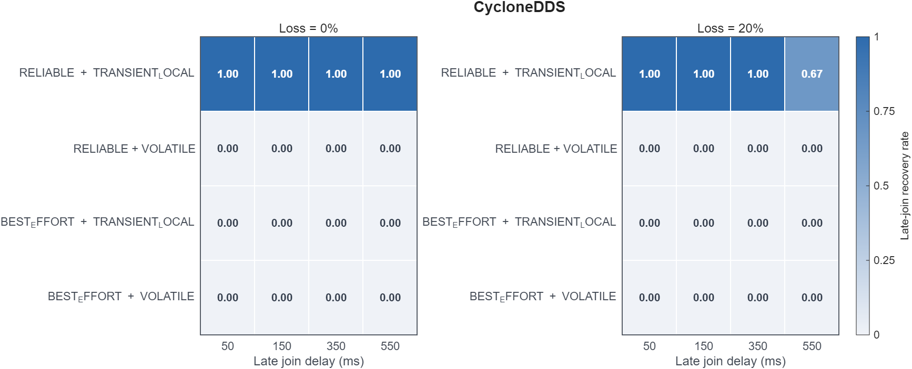
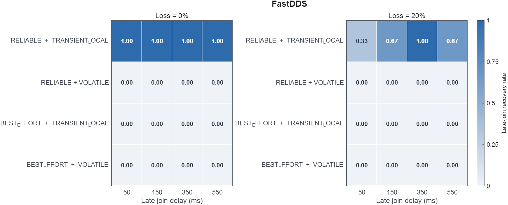

# Best-effort delivery with transient-local durability

<p class="rule-ref-line">Rule 3 &middot; applies to publishers and subscribers &middot; <a href="../../rules/">Back to all rules</a></p>

Breaks a guarantee. Late joiners may not receive the stored history you expect, because best-effort never retransmits the retained samples.

<div class="rule-conflict-callout rule-conflict-guarantee">
<div class="rule-conflict-settings">If you set <b>Reliability = BEST_EFFORT</b> together with <b>Durability = TRANSIENT_LOCAL or stronger</b></div>
<div class="rule-consequence rule-consequence-guarantee">Breaks a guarantee</div>
</div>

- Settings involved: <a href="../../qos/reliability/">Reliability</a> and <a href="../../qos/durability/">Durability</a>
- What QoS Guard checks: `[DURABL ≥ TRAN_LOCAL] ∧ [RELIAB = BEST_EFFORT]`

## Example

A latched map topic uses TRANSIENT_LOCAL but best-effort. A node that starts late can miss the map instead of receiving the retained copy.

## How to fix it

Use RELIABLE together with TRANSIENT_LOCAL so late joiners actually receive the retained samples.

## Why this rule is flagged

#### What the DDS specification says

The DDS specification does not settle this case on its own, so the rule rests on the engine's implementation and direct measurement.

<hr class="evidence-subsection-divider">

#### What the engine source code shows


TRANSIENT_LOCAL late-join replay is gated on the reliable delivery path in both Fast DDS and Cyclone DDS. Under best-effort reliability, historical data is not delivered to late joiners.

!!! note "Fast DDS implementation evidence"
    ```cpp
    // [TRANSIENT_LOCAL late-joiner logic resides within if (is_reliable)]
    // → When best-effort, it returns false, preventing the later-joiner logic from executing → Transient behaviour does not occur
    bool is_reliable = rp->is_reliable();
    if (is_reliable)
    {
        SequenceNumber_t min_seq = get_seq_num_min();
        SequenceNumber_t last_seq = get_seq_num_max();
        RTPSMessageGroup group(mp_RTPSParticipant, this, rp->message_sender());
        // History not empty
        if (min_seq != SequenceNumber_t::unknown())
        {
            (void)last_seq;
            assert(last_seq != SequenceNumber_t::unknown());
            assert(min_seq <= last_seq);
            try {
                // Late-joiner
                if (TRANSIENT_LOCAL <= rp->durability_kind() && TRANSIENT_LOCAL <= m_att.durabilityKind)
    ```

!!! note "Cyclone DDS implementation evidence"
    ```c
    // Providing historical data to late joiners is only performed when it is more efficient than best-effort processing.
    /* Store available data into the late joining reader when it is reliable (we don't do
       historical data for best-effort data over the wire, so also not locally). */
    if (rd->xqos->reliability.kind > DDS_RELIABILITY_BEST_EFFORT && rd->xqos->durability.kind > DDS_DURABILITY_VOLATILE)
        ddsi_deliver_historical_data (wr, rd);
    ```

| Item | Value |
|:---|:---|
| Dataset | [Download CSV](../data/evidence/rule-03/rule-03-data.csv) |
| Fixed QoS setting | None |
| Tested variable | `RELIAB.kind`, `DURABL.kind`, `late_join_ms` |
| Tested values | `RELIAB ∈ {BEST_EFFORT, RELIABLE}`, `DURABL ∈ {VOLATILE, TRANSIENT_LOCAL}`, `late_join_ms ∈ {50, 150, 350, 550}` |
| Rule-relevant case | `RELIAB = BEST_EFFORT`, `DURABL = TRANSIENT_LOCAL` |
| Tested engines / versions | Fast DDS 2.14.6 (Jazzy), Cyclone DDS 0.10.5 |
| Network setting | `RTT = 1 ms`, `loss ∈ {0%, 20%}`, `PP = 50 ms`, `message size = 1024 B` |





Late-join recovery was observed only for `RELIAB = RELIABLE` with `DURABL = TRANSIENT_LOCAL` in the tested loopback measurements.

<hr class="evidence-subsection-divider">

#### What the measurements show

The tested late-join measurements for this rule are shown with the source trace above, so there is no separate result to repeat here.
