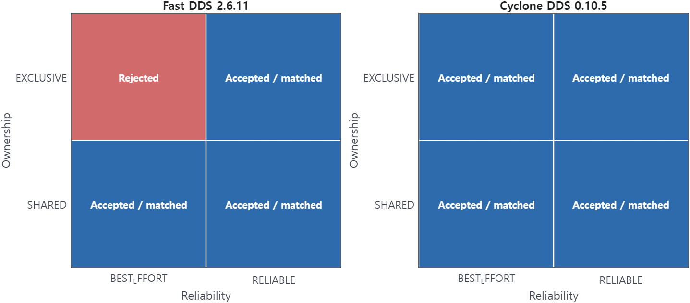

# Best-effort delivery with exclusive ownership

<p class="rule-ref-line">Rule 4 &middot; applies to publishers and subscribers &middot; <a href="../../rules/">Back to all rules</a></p>

Breaks a guarantee, and behavior depends on the DDS version. Fast DDS 2.6 (Humble) rejects it at creation, while Fast DDS 2.14 and Cyclone DDS accept it and fail over slowly.

<div class="rule-conflict-callout rule-conflict-guarantee">
<div class="rule-conflict-settings">If you set <b>Reliability = BEST_EFFORT</b> together with <b>Ownership = EXCLUSIVE</b></div>
<div class="rule-consequence rule-consequence-guarantee">Breaks a guarantee</div>
</div>

- Settings involved: <a href="../../qos/reliability/">Reliability</a> and <a href="../../qos/ownership/">Ownership</a>
- What QoS Guard checks: `[OWNST = EXCLUSIVE] ∧ [RELIAB = BEST_EFFORT]`

## Example

Two redundant sensor publishers use EXCLUSIVE ownership over best-effort. On Humble the reader is rejected. On Jazzy it runs, but failover is slow and can drop samples.

## How to fix it

Use RELIABLE with EXCLUSIVE ownership so the strongest writer's samples are delivered dependably during failover.

## Why this rule is flagged

#### What the DDS specification says

The DDS specification does not settle this case on its own, so the rule rests on the engine's implementation and direct measurement.

<hr class="evidence-subsection-divider">

#### What the engine source code shows

Fast DDS 2.6.11 rejects `BEST_EFFORT` with `EXCLUSIVE` ownership at QoS validation; Fast DDS 2.14.6 accepts the profile.

!!! note "Fast DDS implementation evidence"
    ```cpp
    // Only the FastDDS code contains code that checks this rule.
    if (m_reliability.kind == BEST_EFFORT_RELIABILITY_QOS && m_ownership.kind == EXCLUSIVE_OWNERSHIP_QOS)
    {
        logError(RTPS_QOS_CHECK, "BEST_EFFORT incompatible with EXCLUSIVE ownership");
        return false;
    }
    return true;
    ```

<hr class="evidence-subsection-divider">

#### What the measurements show

| Item | Value |
|:---|:---|
| Dataset | [Download CSV](../data/evidence/rule-04/rule-04-data.csv) |
| Fixed QoS setting | None |
| Tested variable | `RELIAB.kind`, `OWNST.kind` |
| Tested values | `RELIAB ∈ {BEST_EFFORT, RELIABLE}`, `OWNST ∈ {SHARED, EXCLUSIVE}` |
| Rule-relevant case | `RELIAB = BEST_EFFORT`, `OWNST = EXCLUSIVE` |
| Tested engines / versions | Fast DDS 2.6.11 (Humble), Fast DDS 2.14.6 (Jazzy), Cyclone DDS 0.10.5 |
| Network setting | `RTT = 1 ms`, `loss = 0%`, `PP = 50 ms`, `message size = 1024 B` |

| Engine | Tested setting | Observed behavior |
|:---|:---|:---|
| Fast DDS 2.6.11 (Humble) | `RELIAB = BEST_EFFORT`, `OWNST = EXCLUSIVE` | Profile rejected at creation time |
| Fast DDS 2.14.6 (Jazzy) | `RELIAB = BEST_EFFORT`, `OWNST = EXCLUSIVE` | Profile accepted, matched, and delivered |
| Cyclone DDS 0.10.5 | `RELIAB = BEST_EFFORT`, `OWNST = EXCLUSIVE` | Profile accepted, matched, and delivered |



The Humble validation data shows that Fast DDS 2.6.11 rejects `EXCLUSIVE + BEST_EFFORT` at profile creation time, while Cyclone DDS 0.10.5 accepts and matches the same QoS combination.
