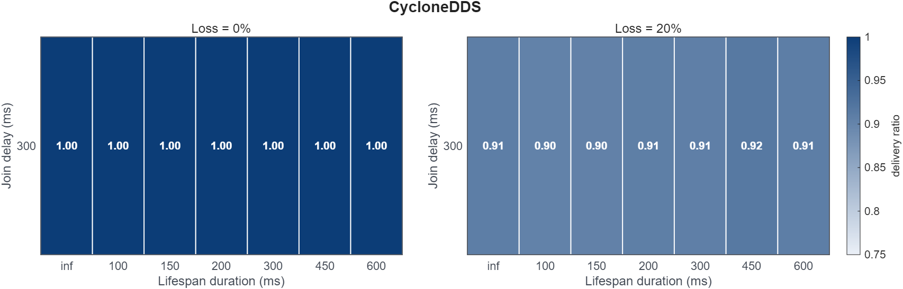
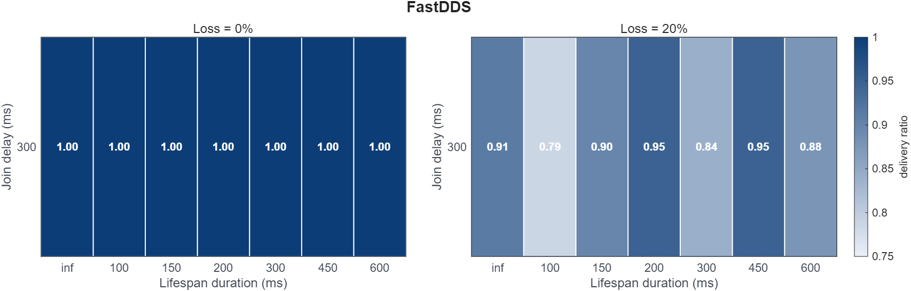

# Finite lifespan expires the history that durability should replay

Rule 6 &middot; applies to the publisher &middot; <a href="../../rules/">Back to all rules</a>

Breaks a guarantee. Stored samples can expire before a late joiner arrives, so there is nothing left to replay.

If you set <b>Durability = TRANSIENT_LOCAL or stronger</b> together with <b>Lifespan set to a finite duration</b>

Breaks a guarantee

- Settings involved: <a href="../../qos/lifespan/">Lifespan</a> and <a href="../../qos/durability/">Durability</a>
- What QoS Guard checks: `[DURABL ≥ TRAN_LOCAL] ∧ [LFSPAN.duration ≠ ∞]`

## Example

A latched config topic has Lifespan 2 s. A node that joins 3 s later receives nothing, because the retained sample already expired.

## How to fix it

Use an infinite Lifespan, or one longer than your worst-case late-join gap, when you rely on durability for late joiners.

## Why this rule is flagged

#### What the DDS specification says

The DDS specification does not settle this case on its own, so the rule rests on direct measurement.

#### What the engine source code shows

This page grounds the rule in the measurement below rather than a separate source trace.

#### What the measurements show

| Item | Value |
|:---|:---|
| Dataset | [Download CSV](../data/evidence/rule-06/rule-06-data.csv) |
| Fixed QoS setting | `RELIAB = RELIABLE`, `DURABL = TRANSIENT_LOCAL` |
| Tested variable | `LIFESPAN.duration` |
| Tested values | `LIFESPAN.duration ∈ {-1 ms, 100 ms, 150 ms, 200 ms, 300 ms, 450 ms, 600 ms}` |
| Rule-relevant case | finite `LIFESPAN.duration` under `DURABL = TRANSIENT_LOCAL` |
| Tested engines / versions | Fast DDS 2.14.6 (Jazzy), Cyclone DDS 0.10.5 |
| Network setting | `RTT = 50 ms`, `loss ∈ {0%, 20%}`, `PP = 10 ms`, `message size = 1024 B` |

#### Measurement result

The heatmaps show average delivery ratio under `DURABL = TRANSIENT_LOCAL` across the tested lifespan values.
