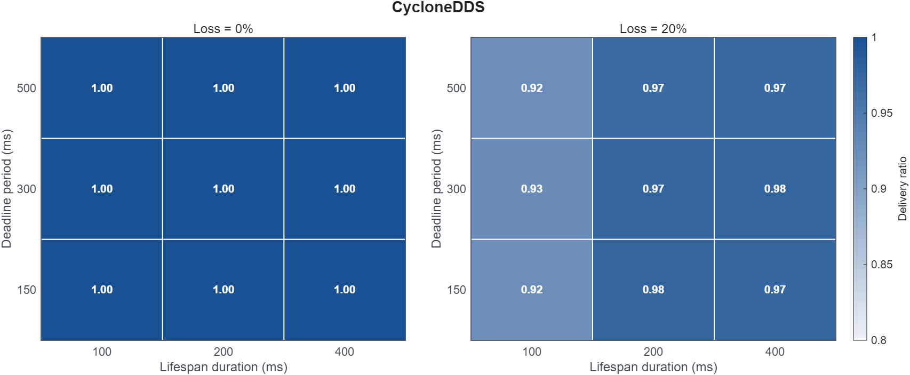
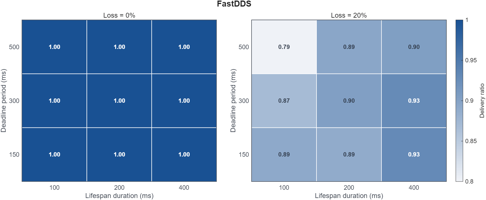

# Lifespan shorter than the deadline period

Rule 7 &middot; applies to the subscriber &middot; <a href="../../rules/">Back to all rules</a>

Breaks a guarantee. Samples can expire before the deadline window closes, so the reader reports missed deadlines even when the writer published on time.

If you set <b>Lifespan duration L</b> together with <b>Deadline period longer than L</b>

Breaks a guarantee

- Settings involved: <a href="../../qos/lifespan/">Lifespan</a> and <a href="../../qos/deadline/">Deadline</a>
- What QoS Guard checks: `LFSPAN.duration < DEADLN.period`

## Example

Lifespan 50 ms with a 100 ms deadline. Every sample expires before the next deadline check, producing constant requested-deadline-missed events.

## How to fix it

Set Lifespan at least as long as the Deadline period.

## Why this rule is flagged

#### What the DDS specification says

The DDS specification does not settle this case on its own, so the rule rests on direct measurement.

#### What the engine source code shows

The behavior here does not depend on a specific engine's implementation, so the rule follows from the measurements.

#### What the measurements show

| Item | Value |
|:---|:---|
| Dataset | [Download CSV](../data/evidence/rule-07/rule-07-data.csv) |
| Fixed QoS setting | None |
| Tested variable | `LIFESPAN.duration`, `DEADLINE.period` |
| Tested values | `LIFESPAN.duration ∈ {100 ms, 200 ms, 400 ms}`, `DEADLINE.period ∈ {150 ms, 300 ms, 500 ms}` |
| Rule-relevant case | `LIFESPAN.duration < DEADLINE.period` |
| Tested engines / versions | Fast DDS 2.14.6 (Jazzy), Cyclone DDS 0.10.5 |
| Network setting | `RTT = 1 ms`, `loss ∈ {0%, 20%}`, `PP = 20 ms`, `message size = 1024 B` |

#### Measurement result

The heatmaps show average delivery ratio across tested lifespan and deadline settings.
