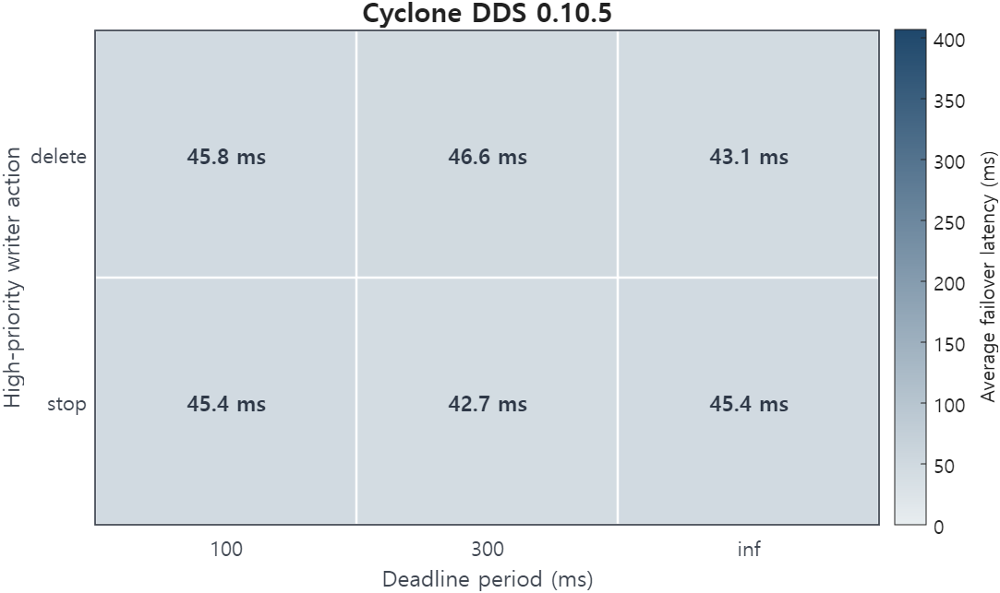
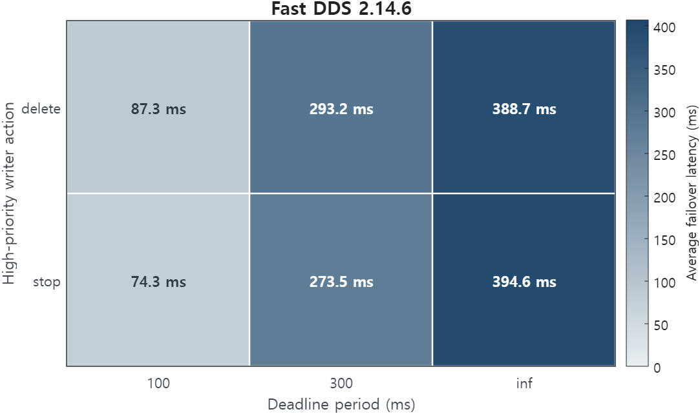

# Exclusive ownership with no deadline to trigger failover

<p class="rule-ref-line">Rule 10 &middot; applies to the subscriber &middot; <a href="../../rules/">Back to all rules</a></p>

Breaks a guarantee. With no deadline, a silent owner is never detected, so ownership never fails over to the backup writer.

<div class="rule-conflict-callout rule-conflict-guarantee">
<div class="rule-conflict-settings">If you set <b>Ownership = EXCLUSIVE</b> together with <b>Deadline period = infinite</b></div>
<div class="rule-consequence rule-consequence-guarantee">Breaks a guarantee</div>
</div>

- Settings involved: <a href="../../qos/deadline/">Deadline</a> and <a href="../../qos/ownership/">Ownership</a>
- What QoS Guard checks: `[OWNST = EXCLUSIVE] ∧ [DEADLN.period = ∞]`

## Example

Primary and backup sensor writers use EXCLUSIVE ownership with an infinite deadline. When the primary stalls, the reader keeps waiting instead of switching to the backup.

## How to fix it

Set a finite Deadline period so a missed deadline can release ownership and let the backup writer take over.

## Why this rule is flagged

#### What the DDS specification says

This page settles the rule through the engine's source trace and the measured failover below rather than a standalone specification clause.

<hr class="evidence-subsection-divider">

#### What the engine source code shows


Exclusive ownership failover is connected to deadline-missed handling in both implementations. In Fast DDS, `deadline_missed()` clears the current owner and triggers owner re-selection. In Cyclone DDS, the deadline-missed callback clears `wr_iid_islive`, which is then used by the exclusive-ownership admission logic.

!!! note "Fast DDS implementation evidence"
    ```cpp
    // deadline_missed(): owner clear and re-selection
    void deadline_missed()
    {
        if (c_Guid_Unknown != current_owner.first)
        {
            if (alive_writers.remove_if([&](const WriterOwnership& item)
            { return item.first == current_owner.first; }))
            {
                current_owner.second = 0;
                current_owner.first  = fastrtps::rtps::c_Guid_Unknown;

                if (ALIVE_INSTANCE_STATE == instance_state)
                {
                    update_owner();
                }
            }
        }
    }
    ```

!!! note "Cyclone DDS implementation evidence"
    ```c
    // deadline_missed_cb clears the live-owner marker
    // dds_rhc_default.c:543
    inst->wr_iid_islive = 0;

    // exclusive ownership checks the same owner-live marker
    // dds_rhc_default.c:1041
    if (rhc->exclusive_ownership &&
        inst->wr_iid_islive &&
        inst->wr_iid != wrinfo->iid)
    {
        ...
    }
    ```

The source trace shows that deadline-missed handling can clear the current ownership state in both engines.

<hr class="evidence-subsection-divider">

#### What the measurements show

| Item | Value |
|:---|:---|
| Dataset | [Download CSV](../data/evidence/rule-10/rule-10-data.csv) |
| Fixed QoS setting | `OWNST = EXCLUSIVE` |
| Tested variable | `DEADLN.period`, `high_action` |
| Tested values | `DEADLN.period ∈ {-1 ms, 100 ms, 300 ms}`, `high_action ∈ {stop, delete}` |
| Rule-relevant case | `OWNST = EXCLUSIVE`, `DEADLN.period = -1 ms` |
| Tested engines / versions | Fast DDS 2.6.11 (Humble), Fast DDS 2.14.6 (Jazzy), Cyclone DDS 0.10.5 |
| Network setting | `RTT = 1 ms`, `loss = 0%`, `PP = 50 ms`, `message size = 1024 B` |

| Engine | Tested setting | Observed behavior |
|:---|:---|:---|
| Fast DDS 2.6.11 (Humble) | `OWNST = EXCLUSIVE`, `DEADLN.period ∈ {-1 ms, 100 ms, 300 ms}`, `high_action ∈ {stop, delete}` | Profile accepted, matched, and delivered; |
| Fast DDS 2.14.6 (Jazzy) | `OWNST = EXCLUSIVE`, `DEADLN.period ∈ {-1 ms, 100 ms, 300 ms}`, `high_action ∈ {stop, delete}` | Profile accepted, matched, and delivered; ownership failover observed with average latency around 252 ms |
| Cyclone DDS 0.10.5 | `OWNST = EXCLUSIVE`, `DEADLN.period ∈ {-1 ms, 100 ms, 300 ms}`, `high_action ∈ {stop, delete}` | Profile accepted, matched, and delivered; ownership failover observed with average latency around 45 ms |

|  |  |
|:---:|:---:|
|  |  |

The heatmaps show that ownership failover occurred in all tested cases; Cyclone DDS failed over consistently around 45 ms, while Fast DDS failover latency increased with the deadline period and was highest under the infinite-deadline setting.
