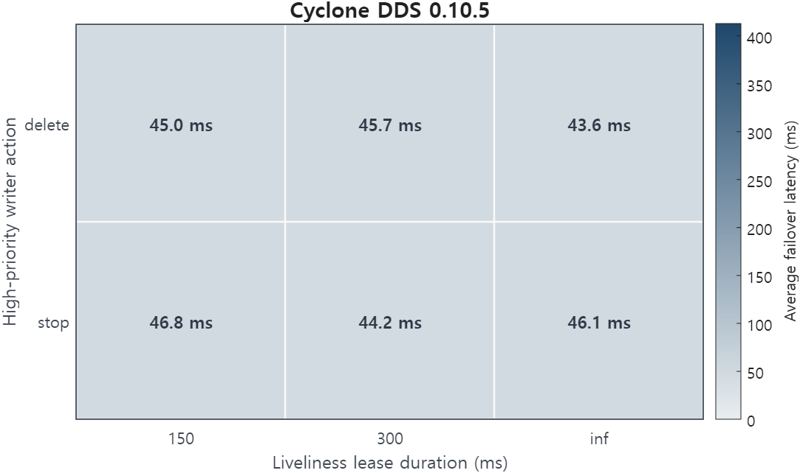
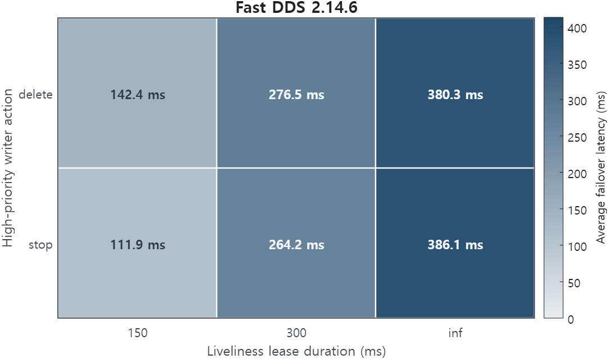

# Exclusive ownership with no liveliness lease to detect a dead writer

<p class="rule-ref-line">Rule 11 &middot; applies to the subscriber &middot; <a href="../../rules/">Back to all rules</a></p>

Breaks a guarantee. A dead owner is never detected, so ownership never transfers to the backup writer.

<div class="rule-conflict-callout rule-conflict-guarantee">
<div class="rule-conflict-settings">If you set <b>Ownership = EXCLUSIVE</b> together with <b>Liveliness lease_duration = infinite</b></div>
<div class="rule-consequence rule-consequence-guarantee">Breaks a guarantee</div>
</div>

- Settings involved: <a href="../../qos/liveliness/">Liveliness</a> and <a href="../../qos/ownership/">Ownership</a>
- What QoS Guard checks: `[OWNST = EXCLUSIVE] ∧ [LIVENS.lease = ∞]`

## Example

The owning writer crashes, but the lease is infinite. The reader never learns the owner is gone and never switches to the backup.

## How to fix it

Set a finite liveliness lease_duration so a lost owner is detected and ownership can fail over.

## Why this rule is flagged

#### What the DDS specification says

This page settles the rule through the engine's source trace and the measured failover below rather than a standalone specification clause.

<hr class="evidence-subsection-divider">

#### What the engine source code shows


Exclusive ownership failover is connected to liveliness-loss handling in both implementations. In Fast DDS, writer unregister/liveliness-loss handling clears the current owner and triggers owner re-selection. In Cyclone DDS, lease expiry marks the proxy writer as not alive and can unregister the writer from the reader history cache, which releases the ownership state.

!!! note "Fast DDS implementation evidence"
    ```cpp
    // writer_unregister(): owner clear and re-selection
    if (writer_guid == current_owner.first)
    {
        current_owner.second = 0;
        current_owner.first  = fastrtps::rtps::c_Guid_Unknown;

        if (ALIVE_INSTANCE_STATE == instance_state)
        {
            update_owner();
        }
    }
    ```

!!! note "Cyclone DDS implementation evidence"
    ```c
    // lease expiry marks the proxy writer as not alive
    // q_lease.c:294
    ddsi_proxy_writer_set_notalive(pwr, true);

    // not-alive writer can be unregistered from the reader history cache
    // ddsi_endpoint.c:302
    if (delta < 0 && rd->rhc)
    {
        ddsi_rhc_unregister_wr(rd->rhc, &wrinfo);
    }

    // unregister releases the live-owner marker
    // dds_rhc_default.c:1302
    inst->wr_iid_islive = 0;
    ```

<hr class="evidence-subsection-divider">

#### What the measurements show

| Item | Value |
|:---|:---|
| Dataset | [Download CSV](../data/evidence/rule-11/rule-11-data.csv) |
| Fixed QoS setting | `OWNST = EXCLUSIVE` |
| Tested variable | `LIVENS.lease_duration`, `high_action` |
| Tested values | `LIVENS.lease_duration ∈ {-1 ms, 150 ms, 300 ms}`, `high_action ∈ {stop, delete}` |
| Rule-relevant case | `OWNST = EXCLUSIVE`, `LIVENS.lease_duration = -1 ms` |
| Tested engines / versions | Fast DDS 2.6.11 (Humble), Fast DDS 2.14.6 (Jazzy), Cyclone DDS 0.10.5 |
| Network setting | `RTT = 1 ms`, `loss = 0%`, `PP = 50 ms`, `message size = 1024 B` |

| Engine | Tested setting | Observed behavior |
|:---|:---|:---|
| Fast DDS 2.6.11 (Humble) | `OWNST = EXCLUSIVE`, `LIVENS.lease_duration ∈ {-1 ms, 150 ms, 300 ms}`, `high_action ∈ {stop, delete}` | Profile accepted, matched, and delivered;  |
| Fast DDS 2.14.6 (Jazzy) | `OWNST = EXCLUSIVE`, `LIVENS.lease_duration ∈ {-1 ms, 150 ms, 300 ms}`, `high_action ∈ {stop, delete}` | Profile accepted, matched, and delivered; ownership failover observed with average latency around 260 ms |
| Cyclone DDS 0.10.5 | `OWNST = EXCLUSIVE`, `LIVENS.lease_duration ∈ {-1 ms, 150 ms, 300 ms}`, `high_action ∈ {stop, delete}` | Profile accepted, matched, and delivered; ownership failover observed with average latency around 45 ms |

|  |  |
|:---:|:---:|
|  |  |

The heatmaps show that ownership failover occurred in all tested cases; Cyclone DDS failed over consistently around 45 ms, while Fast DDS failover latency increased with the liveliness lease duration and was highest under the infinite-lease setting.
