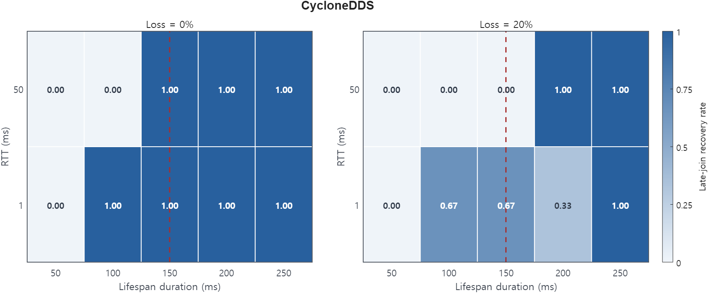
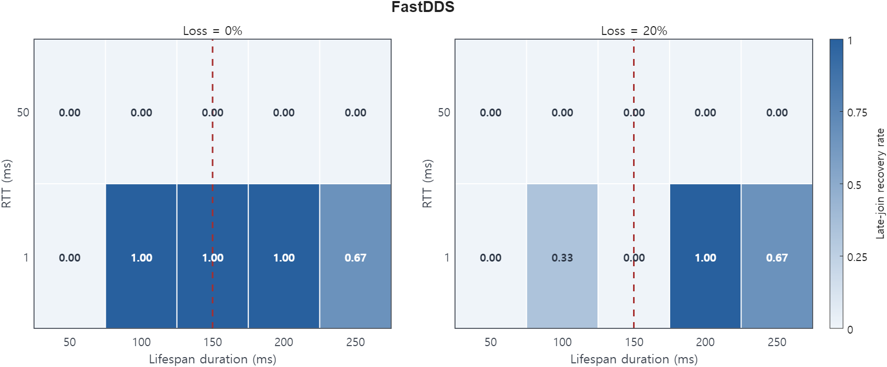
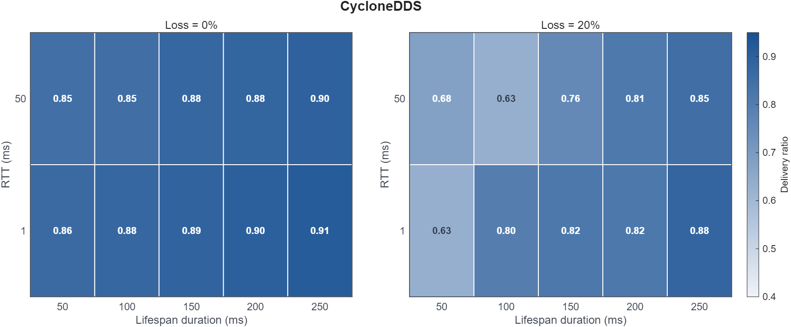
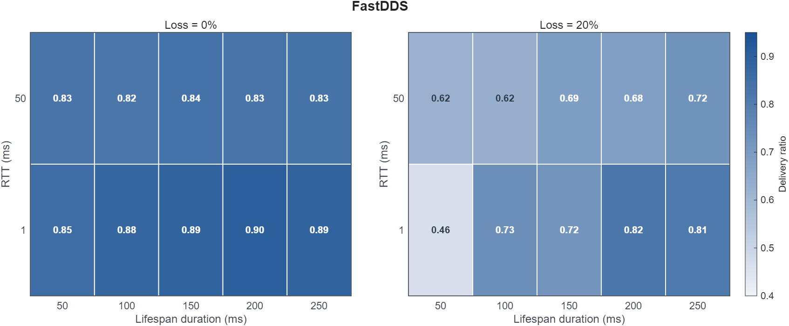

# Lifespan longer than the resource-limit buffer can ever hold

Rule 18 &middot; applies to publishers and subscribers &middot; <a href="../../rules/">Back to all rules</a>

Wastes effort. The buffer fills and drops samples before the Lifespan expires, so the extra validity never takes effect.

If you set <b>History = KEEP_ALL bounded by max_samples_per_instance M</b> together with <b>Lifespan longer than M publish periods</b>

Wastes resources

- Settings involved: <a href="../../qos/resource-limits/">Resource Limits</a> and <a href="../../qos/lifespan/">Lifespan</a>
- What QoS Guard checks: `[HIST.kind = KEEP_ALL] ∧ [LFSPAN.duration > RESLIM.mpi × PP]`

## Example

max_samples_per_instance 10 at a 20 ms period holds about 200 ms, but Lifespan is 2 s. Samples are evicted by capacity long before they expire.

## How to fix it

Match Lifespan to the buffer capacity. Raise max_samples_per_instance or lower Lifespan.

## Why this rule is flagged

#### What the DDS specification says

The DDS specification does not settle this case on its own, so the rule rests on direct measurement.

#### What the engine source code shows

This page grounds the rule in the measurement below rather than a separate source trace.

#### What the measurements show

| Item | Value |
|:---|:---|
| Dataset | [Download CSV](../data/evidence/rule-18/rule-18-data.csv) |
| Fixed QoS setting | `HIST.kind = KEEP_ALL`, `RESLIM.mpi = 3`, `DURABL = TRANSIENT_LOCAL` |
| Tested variable | `LIFESPAN.duration` |
| Tested values | `LIFESPAN.duration ∈ {50 ms, 100 ms, 150 ms, 200 ms, 250 ms}` |
| Rule boundary | `RESLIM.mpi × PP = 3 × 50 ms = 150 ms` |
| Rule-relevant case | `LIFESPAN.duration > RESLIM.mpi × PP`, i.e., `LIFESPAN.duration ∈ {200 ms, 250 ms}` |
| Tested engines / versions | Fast DDS 2.14.6 (Jazzy), Cyclone DDS 0.10.5 |
| Network setting | `RTT ∈ {1 ms, 50 ms}`, `loss ∈ {0%, 20%}`, `PP = 50 ms`, `message size = 1024 B` |
| Primary metric | `late_join_recovered` |
| Supplementary metric | `delivery_ratio` |

#### Measurement result

##### Main late-join recovery view

The heatmaps show late-join recovery as `LIFESPAN.duration` crosses the `RESLIM.mpi × PP = 150 ms` window.

##### Supplementary delivery-ratio view

The supplementary heatmaps show average delivery ratio under the same settings; the primary Rule 18 evidence is the late-join recovery view above.
