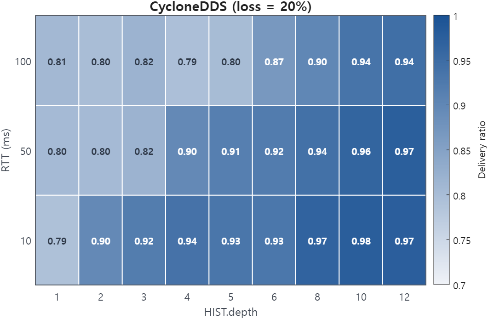
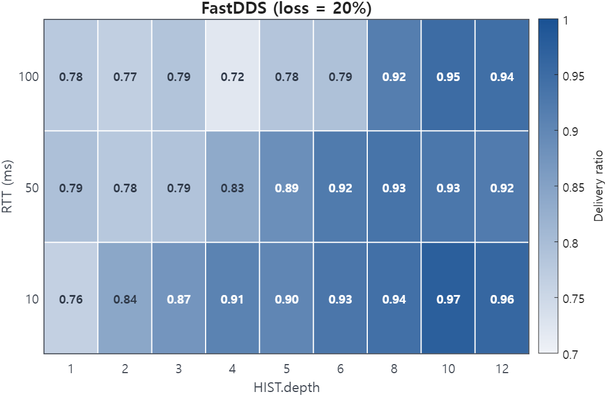

# Reliable history too shallow for the round-trip

Rule 31 &middot; applies to the publisher &middot; <a href="../../rules/">Back to all rules</a>

Breaks a guarantee. Under delay and loss the writer overwrites samples before they are acknowledged, so reliable delivery collapses and messages are dropped.

If you set <b>Reliability = RELIABLE with KEEP_LAST depth D</b> together with <b>a depth smaller than one round-trip of samples</b>

Breaks a guarantee

- Settings involved: <a href="../../qos/history/">History</a> and <a href="../../qos/reliability/">Reliability</a>
- What QoS Guard checks: `[RELIABLE] ∧ [KEEP_LAST] ∧ [HIST.depth < ⌈2×RTT/PP⌉+1]`

## Example

At 100 ms RTT and a 20 ms publish period you need depth about 11, but depth is 5. Delivery falls off a cliff under 20% loss.

## How to fix it

Size KEEP_LAST depth to at least ceil(2 x RTT / PP) + 1, or use KEEP_ALL with adequate resource limits.

## Why this rule is flagged

#### What the DDS specification says

The DDS specification does not settle this case on its own, so the rule rests on direct measurement.

#### What the engine source code shows

The behavior here does not depend on a specific engine's implementation, so the rule follows from the measurements.

#### What the measurements show

| Item | Value |
|:---|:---|
| Dataset | [Download CSV](../data/evidence/rule-31/rule-31-data.csv) |
| Fixed QoS setting | `RELIAB = RELIABLE`, `HIST.kind = KEEP_LAST` |
| Tested variable | `HIST.depth`, `RTT` |
| Tested values | `HIST.depth ∈ {1, 2, 3, 4, 5, 6, 8, 10, 12}`, `RTT ∈ {10 ms, 50 ms, 100 ms}` |
| Rule boundary | `HIST.depth < ceil(2 × RTT / PP) + 1`, with `PP = 20 ms` |
| Boundary values | `RTT = 10 ms → threshold = 2`, `RTT = 50 ms → threshold = 6`, `RTT = 100 ms → threshold = 11` |
| Tested engines / versions | Fast DDS 2.14.6 (Jazzy), Cyclone DDS 0.10.5 |
| Network setting | `RTT ∈ {10 ms, 50 ms, 100 ms}`, `loss ∈ {0%, 20%}`, `PP = 20 ms`, `message size = 1024 B` |

#### Measurement result

  
  

The heatmaps show average delivery ratio across tested HIST.depth values under loss = 20%; the rule boundary is computed as ceil(2 × RTT / PP) + 1.
