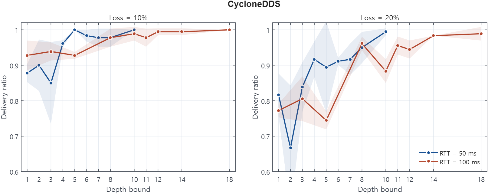

# Reliable buffer too small for the round-trip

Rule 32 &middot; applies to the publisher &middot; <a href="../../rules/">Back to all rules</a>

Breaks a guarantee. The send buffer fills before acknowledgments return, so the writer cannot retransmit and reliable delivery drops samples.

If you set <b>Reliability = RELIABLE with KEEP_ALL</b> together with <b>max_samples_per_instance smaller than one round-trip of samples</b>

Breaks a guarantee

- Settings involved: <a href="../../qos/resource-limits/">Resource Limits</a> and <a href="../../qos/reliability/">Reliability</a>
- What QoS Guard checks: `[RELIABLE] ∧ [HIST.kind=KEEP_ALL] ∧ [RESLIM.mpi < ⌈2×RTT/PP⌉+1]`

## Example

At 100 ms RTT and a 20 ms period you need about 11 slots, but max_samples_per_instance is 4. Delivery collapses under loss.

## How to fix it

Raise max_samples_per_instance to at least ceil(2 x RTT / PP) + 1 for reliable KEEP_ALL over lossy links.

## Why this rule is flagged

#### What the DDS specification says

The DDS specification does not settle this case on its own, so the rule rests on direct measurement.

#### What the engine source code shows

The behavior here does not depend on a specific engine's implementation, so the rule follows from the measurements.

#### What the measurements show

| Item | Value |
|:---|:---|
| Dataset | [Download CSV](../data/evidence/rule-32/rule-32-overwrite-data.csv) |
| Fixed QoS setting | `RELIAB = RELIABLE`, overwrite-mode `drop_kl` |
| Tested variable | `depth_bound` |
| Tested values | `depth_bound ∈ {1, 2, 3, 4, 5, 6, 7, 8, 10, 11, 12, 14, 18}` |
| Rule boundary | `ceil(2 × RTT / PP) + 1` |
| Boundary values | `RTT = 50 ms, PP = 20 ms → threshold = 6`; `RTT = 100 ms, PP = 20 ms → threshold = 11` |
| Tested engine / version | Cyclone DDS 0.10.5 |
| Network setting | `RTT ∈ {50 ms, 100 ms}`, `loss ∈ {10%, 20%}`, `PP = 20 ms`, `message size = 1024 B` |

#### Measurement result

The overwrite-mode measurement shows Cyclone DDS drop_kl delivery behavior across tested depth_bound values, with the rule boundary computed as ceil(2 × RTT / PP) + 1.
