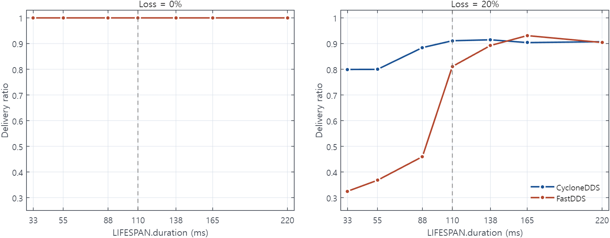

# Lifespan expires samples before reliable retransmission finishes

Rule 33 &middot; applies to the publisher &middot; <a href="../../rules/">Back to all rules</a>

Breaks a guarantee. A lost sample expires before its retransmission arrives, so reliability cannot recover it.

If you set <b>Reliability = RELIABLE</b> together with <b>Lifespan shorter than one publish period plus a round-trip</b>

Breaks a guarantee

- Settings involved: <a href="../../qos/lifespan/">Lifespan</a> and <a href="../../qos/reliability/">Reliability</a>
- What QoS Guard checks: `[RELIABLE] ∧ [LFSPAN.duration < PP + 2×RTT]`

## Example

Lifespan 30 ms with a 20 ms period and 50 ms RTT. Retransmitted samples arrive after they have already expired.

## How to fix it

Set Lifespan longer than PP + 2 x RTT so retransmitted samples are still valid on arrival.

## Why this rule is flagged

#### What the DDS specification says

The DDS specification does not settle this case on its own, so the rule rests on direct measurement.

#### What the engine source code shows

The behavior here does not depend on a specific engine's implementation, so the rule follows from the measurements.

#### What the measurements show

| Item | Value |
|:---|:---|
| Dataset | [Download CSV](../data/evidence/rule-33/rule-33-data.csv) |
| Fixed QoS setting | `RELIAB = RELIABLE` |
| Tested variable | `LIFESPAN.duration` |
| Tested values | `LIFESPAN.duration ∈ {33 ms, 55 ms, 88 ms, 110 ms, 138 ms, 165 ms, 220 ms}` |
| Rule boundary | `PP + 2 × RTT = 10 ms + 2 × 50 ms = 110 ms` |
| Rule-relevant case | `LIFESPAN.duration < PP + 2 × RTT`, i.e., `LIFESPAN.duration ∈ {33 ms, 55 ms, 88 ms}` |
| Tested engines / versions | Fast DDS 2.14.6 (Jazzy), Cyclone DDS 0.10.5 |
| Network setting | `RTT = 50 ms`, `loss ∈ {0%, 20%}`, `PP = 10 ms`, `message size = 1024 B` |

#### Measurement result

The heatmap shows average delivery ratio across tested LIFESPAN.duration values, with 110 ms marking the PP + 2 × RTT boundary.
