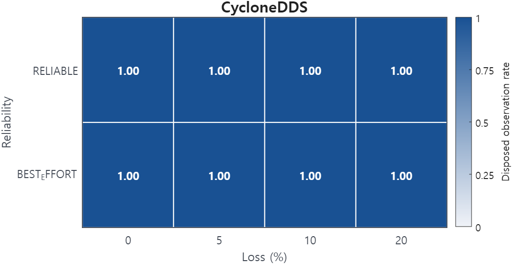
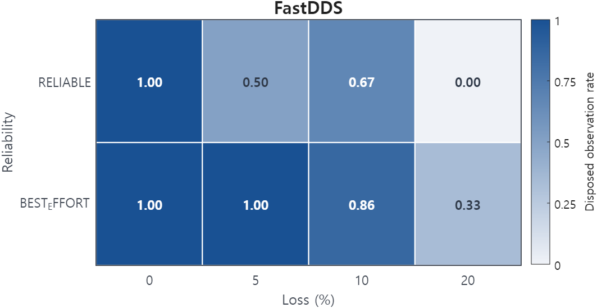

# Best-effort delivery drops the dispose notification

Rule 34 &middot; applies to the publisher &middot; <a href="../../rules/">Back to all rules</a>

Breaks a guarantee. The unregister or dispose message can be lost, so the reader never learns the instance was disposed.

If you set <b>Writer autodispose_unregistered_instances = true</b> together with <b>Reliability = BEST_EFFORT</b>

Breaks a guarantee

- Settings involved: <a href="../../qos/reliability/">Reliability</a> and <a href="../../qos/writer-data-lifecycle/">Writer Data Lifecycle</a>
- What QoS Guard checks: `[W.autodispose = TRUE] ∧ [RELIAB = BEST_EFFORT]`

## Example

A best-effort writer disposes an instance on shutdown, but the dispose packet is lost and the reader keeps the instance alive.

## How to fix it

Use RELIABLE when auto-dispose lifecycle notifications must be delivered.

## Why this rule is flagged

#### What the DDS specification says

The DDS specification does not settle this case on its own, so the rule rests on direct measurement.

#### What the engine source code shows

The behavior here does not depend on a specific engine's implementation, so the rule follows from the measurements.

#### What the measurements show

| Item | Value |
|---|---|
| Dataset | [Download CSV](../data/evidence/rule-34/rule-34-data.csv) |
| Fixed QoS setting | None |
| Tested variable | `RELIAB.kind`, `WDLIFE.autodispose_unregistered_instances` |
| Tested values | `RELIAB ∈ {BEST_EFFORT, RELIABLE}`, `autodispose ∈ {true, false}` |
| Rule-relevant case | `autodispose = true`, `RELIAB = BEST_EFFORT` |
| Tested engines / versions | Fast DDS 2.14.6 (Jazzy), Cyclone DDS 0.10.5 |
| Network setting | `RTT ∈ {1 ms, 50 ms}`, `loss ∈ {0%, 5%, 10%, 20%}`, `PP = 50 ms`, `message size = 1024 B` |

#### Measurement result

  
  

The heatmaps show the observed `disposed` rate for `autodispose = true`; Cyclone DDS preserved the disposed observation across tested loss levels, while Fast DDS showed lower disposed observation rates under higher loss.
