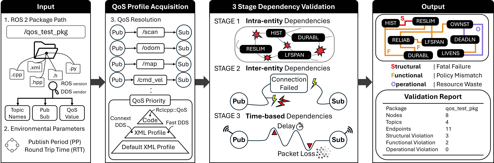

# QoS Guard

**Catch broken ROS 2 QoS settings before they reach your robot.**

In ROS 2, every topic connection runs on DDS and its Quality of Service (QoS) policies, such as reliability, durability, history, and deadline. When a publisher and a subscriber use QoS settings that do not match, or a single node uses an unsafe combination, communication breaks in ways that are hard to see. Nodes fail to connect, messages are silently dropped, or a process crashes at runtime. These failures rarely print a clear error, so teams lose hours guessing which policy is at fault.

## What QoS Guard does

QoS Guard scans your ROS 2 package and flags risky QoS before you deploy. It reads your **XML profiles** and **source code** (for example `rclcpp::QoS` and `create_publisher`), pairs up every publisher and subscriber by topic, and checks each pair against a library of known QoS conflicts. It then reports the risky pairs, grouped by how badly they break communication. There is no runtime to launch, no robot to connect, and no live ROS 2 session required. You point it at a package and read the report.

<style>
.feature-grid {
    display: grid;
    grid-template-columns: 1fr 1fr;
    gap: 16px;
    margin: 24px 0;
}

.feature-card {
    display: flex;
    align-items: flex-start;
    padding: 18px;
    background: #ffffff;
    border: 1px solid #e2e8f0;
    border-radius: 12px;
}

.feature-icon {
    font-size: 20px;
    margin-right: 14px;
    margin-top: 2px;
}

.feature-content strong {
    display: block;
    font-size: 15px;
    color: #1e293b;
    margin-bottom: 4px;
}

.feature-content span {
    font-size: 13px;
    color: #64748b;
    line-height: 1.5;
}

@media (max-width: 768px) {
    .feature-grid {
        grid-template-columns: 1fr;
    }
}

.req-container {
    margin: 20px 0;
    border: 1px solid #e2e8f0;
    border-radius: 8px;
    background-color: #ffffff;
    overflow: hidden;
}

.req-item {
    display: flex;
    align-items: center;
    padding: 12px 16px;
    border-bottom: 1px solid #e2e8f0;
}

.req-item:last-child {
    border-bottom: none;
}

.req-label {
    min-width: 100px;
    font-weight: 700;
    color: #334155;
    font-size: 13px;
    text-transform: uppercase;
    letter-spacing: 0.05em;
}

.req-value {
    color: #334155;
    font-size: 14px;
    border-left: 2px solid #e2e8f0;
    padding-left: 16px;
    margin-left: 8px;
}

.severity-grid {
    display: grid;
    grid-template-columns: repeat(3, 1fr);
    gap: 16px;
    margin: 20px 0;
}

.severity-card {
    padding: 18px;
    background: #ffffff;
    border: 1px solid #e2e8f0;
    border-radius: 12px;
    border-left: 4px solid #94a3b8;
}

.severity-card.structural {
    border-left-color: #dc2626;
}

.severity-card.functional {
    border-left-color: #ea580c;
}

.severity-card.operational {
    border-left-color: #4E5EB4;
}

.severity-card .severity-title {
    font-weight: 700;
    font-size: 14px;
    color: #1e293b;
    margin-bottom: 8px;
    text-transform: uppercase;
    letter-spacing: 0.04em;
}

.severity-card .severity-desc {
    font-size: 13px;
    color: #64748b;
    line-height: 1.5;
    margin-bottom: 10px;
}

.severity-card .severity-action {
    font-size: 12px;
    color: #475569;
    padding-top: 10px;
    border-top: 1px solid #f1f5f9;
    font-style: italic;
}

@media (max-width: 768px) {
    .severity-grid {
        grid-template-columns: 1fr;
    }
}
</style>

<div class="feature-grid">
  <div class="feature-card">
    <div class="feature-icon">⚡</div>
    <div class="feature-content">
      <strong>Static, no runtime</strong>
      <span>Analyzes source and XML offline. No <code>ros2 run</code>, no robot, no live ROS 2 session.</span>
    </div>
  </div>
  <div class="feature-card">
    <div class="feature-icon">⏱️</div>
    <div class="feature-content">
      <strong>Auto-detects publish rates</strong>
      <span>Extracts each topic's publish period from its timer, so you set only the RTT.</span>
    </div>
  </div>
  <div class="feature-card">
    <div class="feature-icon">📂</div>
    <div class="feature-content">
      <strong>Package mode</strong>
      <span>Point to a package path → auto-scan XML + code, verify all topic pairs</span>
    </div>
  </div>
  <div class="feature-card">
    <div class="feature-icon">📄</div>
    <div class="feature-content">
      <strong>XML pair mode</strong>
      <span>Point to one pub XML + one sub XML → verify that pair only (Fast/Connext)</span>
    </div>
  </div>
</div>

<figure style="text-align: center;">
  
  <figcaption style="font-style: italic; color: #666; margin-top: 10px;">
    QoS Guard Framework
  </figcaption>
</figure>

<hr class="hr-grad-left">

## Get started

Install QoS Guard (see [Installation](#installation) below), then point it at any ROS 2 package.

> **Check a whole package**

```bash
qos_guard /path/to/your_ros2_package
```

> **Specify DDS and ROS version**

```bash
qos_guard /path/to/package fast jazzy
```

> **No ROS 2 installed? Run from the repo root**

```bash
cd /path/to/QoS-Guard
python3 -m qos_guard.qos_checker /path/to/package
```

<hr class="hr-grad-left">

## Where to go next

New to DDS QoS? Follow these pages in order. Each page stands on its own, so you can also jump straight to whatever you need.

| Step | Page | What you get |
|:---|:---|:---|
| 1 | [QoS Encyclopedia](qos/index.md) | Plain-language definitions of the 16 QoS policies and when each one matters |
| 2 | [Dependency Map](chain.md) | How the policies affect one another, shown as an interactive graph and a quick lookup table |
| 3 | [Rules & Evidence](rules/index.md) | The exact QoS combinations QoS Guard flags, each with a worked explanation and the test data behind it |
| 4 | [Paper](paper.md) | The research background and abstract, for readers who want the full study |

<hr class="hr-grad-left">

## Requirements

<div class="req-container">
  <div class="req-item">
    <span class="req-label">Python</span>
    <span class="req-value">3.10 or higher</span>
  </div>
  <div class="req-item">
    <span class="req-label">ROS 2</span>
    <span class="req-value">Optional (Humble, Jazzy, or Kilted)</span>
  </div>
  <div class="req-item">
    <span class="req-label">OS</span>
    <span class="req-value">Linux recommended / Windows (Python only)</span>
  </div>
</div>

<hr class="hr-grad-left">

## Installation

### Option A: ROS 2 package (recommended)

**1. Clone into your workspace src**

```bash
mkdir -p ~/ros2_ws/src
cd ~/ros2_ws/src
git clone <repository_URL> qos-guard
```

**2. Build and source**

```bash
cd ~/ros2_ws
colcon build --packages-select qos_guard
source install/setup.bash
```

**3. Run**

```bash
ros2 run qos_guard qos_guard /path/to/any/ros2/package
```

### Option B: Standalone

**1. Clone and go to repo root**

```bash
cd /path/to/QoS-Guard
```

**2. Run**

```bash
python3 -m qos_guard.qos_checker /path/to/your_ros2_package
```

<hr class="hr-grad-left">

## Usage modes

### Package mode (default)

Check a whole ROS 2 package. The tool finds XML files and scans source for publishers/subscribers, builds pairs by topic, and runs rule checks.

```bash
qos_guard <package_path> [dds] [ros_version] [publish_period=<N>ms] [rtt=<N>ms]
```

### XML pair mode

Verify one writer XML and one reader XML (Fast DDS and Connext only).

```bash
qos_guard --xml <pub.xml> <sub.xml> <dds> <ros_version> [publish_period=<N>ms] [rtt=<N>ms]
```

> **Cyclone DDS** does not support XML QoS profiles. For Cyclone, use **package mode** only.

### List mode

List XML files the tool would scan under a package.

```bash
qos_guard --list <package_path>
```

Extended usage notes, DDS support tables, FAQ, and test-package details are in [QoS_Guard.md](QoS_Guard.md).

<hr class="hr-grad-left">

## Verification results

The tool reports violations by **severity**:

<div class="severity-grid">
  <div class="severity-card structural">
    <div class="severity-title">Structural</div>
    <div class="severity-desc">RMW-level incompatibility; connection can fail or process may crash.</div>
    <div class="severity-action">Fix first; these block communication.</div>
  </div>
  <div class="severity-card functional">
    <div class="severity-title">Functional</div>
    <div class="severity-desc">Connection may work but guarantees (reliability, durability, etc.) are broken.</div>
    <div class="severity-action">Risk of data loss or late-joiner issues; fix when possible.</div>
  </div>
  <div class="severity-card operational">
    <div class="severity-title">Operational</div>
    <div class="severity-desc">No functional bug but inefficient (e.g. extra memory or bandwidth).</div>
    <div class="severity-action">Optional to fix; improves resource use.</div>
  </div>
</div>

If there are **no violations**, you see: **`All Entities are safe !`**
