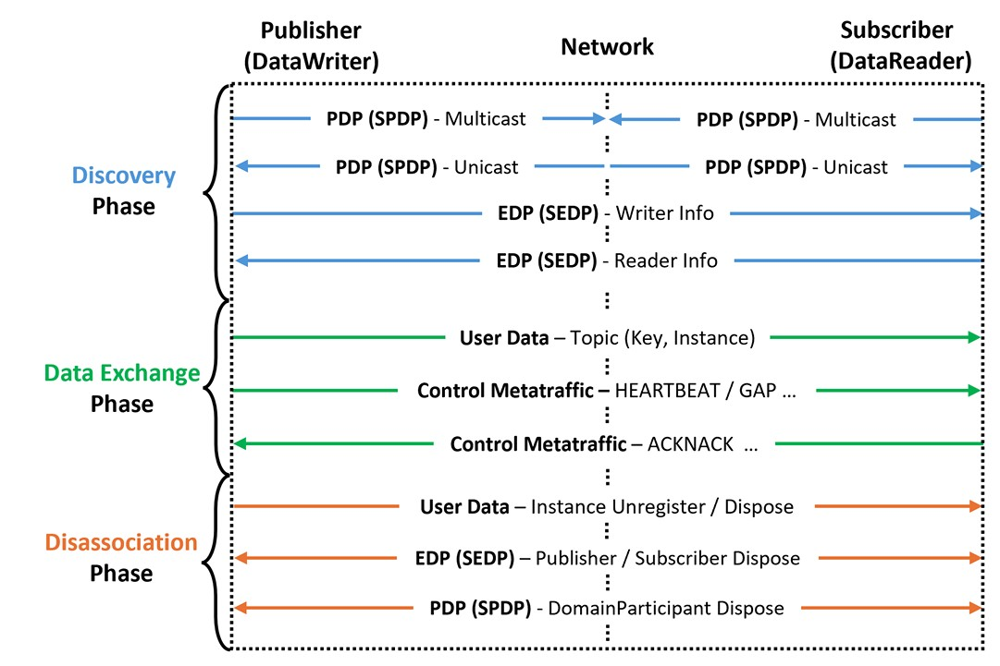

# DDS QoS Policy Guide

> A plain-language reference to the 16 DDS QoS policies that shape every ROS 2 topic.

QoS policies are the settings that decide how a topic behaves, for example whether delivery is guaranteed, whether a node that joins late still receives past messages, and how long each message stays in the queue. Every policy has its own page here that explains what it does, the values it accepts, and how it acts at each stage of a connection. Start anywhere or read straight through, then follow the links to the [Dependency Map](../chain.md) to see how policies affect one another, or to [Rules & Evidence](../rules/index.md) to see which combinations QoS Guard flags.

## 16 QoS Policies

  <a href="entity-factory/" class="qos-card">01
ENTITY FACTORYENTFAC — discovery timing
</a>
  <a href="partition/" class="qos-card">02
PARTITIONPART — logical segmentation
</a>
  <a href="user-data/" class="qos-card">03
USER DATAUSRDATA — participant metadata
</a>
  <a href="group-data/" class="qos-card">04
GROUP DATAGRPDATA — pub/sub metadata
</a>
  <a href="topic-data/" class="qos-card">05
TOPIC DATATOPDATA — topic metadata
</a>
  <a href="reliability/" class="qos-card">06
RELIABILITYRELIAB — delivery guarantee
</a>
  <a href="durability/" class="qos-card">07
DURABILITYDURABL — late joiners
</a>
  <a href="deadline/" class="qos-card">08
DEADLINEDEADLN — temporal constraints
</a>
  <a href="liveliness/" class="qos-card">09
LIVELINESSLIVENS — publisher activity
</a>
  <a href="history/" class="qos-card">10
HISTORYHIST — sample retention
</a>
  <a href="resource-limits/" class="qos-card">11
RESOURCE LIMITSRESLIM — cache bounds
</a>
  <a href="lifespan/" class="qos-card">12
LIFESPANLFSPAN — sample validity
</a>
  <a href="ownership/" class="qos-card">13
OWNERSHIPOWNST — multiple writers
</a>
  <a href="destination-order/" class="qos-card">14
DESTINATION ORDERDESTORD — sample ordering
</a>
  <a href="writer-data-lifecycle/" class="qos-card">15
WRITER DATA LIFECYCLEWDLIFE — instance cleanup
</a>
  <a href="reader-data-lifecycle/" class="qos-card">16
READER DATA LIFECYCLERDLIFE — purge timing
</a>

## Lifecycle of DDS Communication

  
    <figcaption style="font-style: italic; color: #666; margin-top: 10px;">
    Three Phases: Discovery → Data Exchange → Disassociation.
  </figcaption>

  
1. Discovery Phase

  

    Entities with the same topic are matched through <b>PDP/EDP protocols</b> and  established after verifying <b>QoS compatibility</b>.
  

  
2. Data Exchange Phase

  

    Matched pairs exchange <b>user data</b> and <b>control metatraffic</b> (HEARTBEAT/ACKNACK) to  ensure reliability and timeliness.
  

  
3. Disassociation Phase

  

    Communication ends by <b>disposing instances</b> or removing GUIDs, followed by  purging all history after a <b>timeout</b>.
  

  
Lifecycle Mapping

  

    

        QoS Policy
        Discovery
        Data Exchange
        Disassociation
    

    
ENTITY_FACTORY
        O
        
        
    

    
PARTITION
        O
        
        
    

    
USER_DATA
        O
        
        
    

    
GROUP_DATA
        O
        
        
    

    

        TOPIC_DATA
        O
        
        
    

    
RELIABILITY
        O
        O
        O
    

    

        DURABILITY
        O
        O
        O
    

DEADLINE
        O
        O
        
    

    

        LIVELINESS
        O
        O
        O
    

    

        HISTORY
        
        O
        
    

    

        RESOURCE_LIMITS
        
        O
        
    

    
LIFESPAN
        
        O
        
    

    

        OWNERSHIP
        O
        O
        O
    

    
DESTINATION_ORDER
        O
        O
        
    

    

        WRITER_DATA_LIFECYCLE
        
        
        O
    

    

        READER_DATA_LIFECYCLE
        
        
        O
    

## Summary: Metadata, Matching, Cache, and Lifecycle

  

    Category
    QoS
    One-line summary
  

  

    Discovery timing
    ENTFAC
    When entities participate in discovery
  

  

    Logical segmentation
    PART
    Partition names to separate or group topic flows
  

  

    Metadata
    USRDATA, GRPDATA, TOPDATA
    Application info on Participant / Pub-Sub / Topic
  

  

    Delivery guarantee
    RELIAB
    best_effort vs reliable (retransmission, ordering)
  

  

    Late joiners
    DURABL
    How much past data late joiners can receive
  

  

    Temporal constraints
    DEADLN, LIVENS
    Period (deadline) monitoring; Publisher liveness
  

  

    Cache
    HIST, RESLIM, LFSPAN
    How many samples, upper bounds, validity duration
  

  

    Multiple writers
    OWNST, DESTORD
    Single owner vs shared; order by reception vs source timestamp
  

  

    Instance cleanup
    WDLIFE, RDLIFE
    Dispose on unregister; when to purge disposed/no-writer samples
  

## Next steps

| Section | Use it for |
|:---|:---|
| [Dependency Map](../chain.md) | See how the policies affect one another across all 40 rules |
| [Rules & Evidence](../rules/index.md) | Open each rule with its conflict condition, engine checks, and the evidence behind it |
