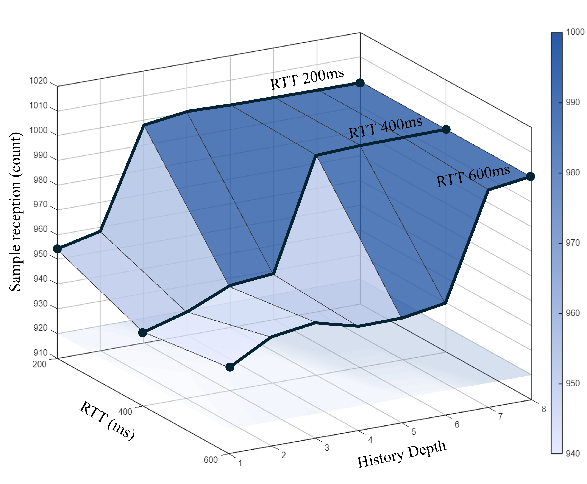
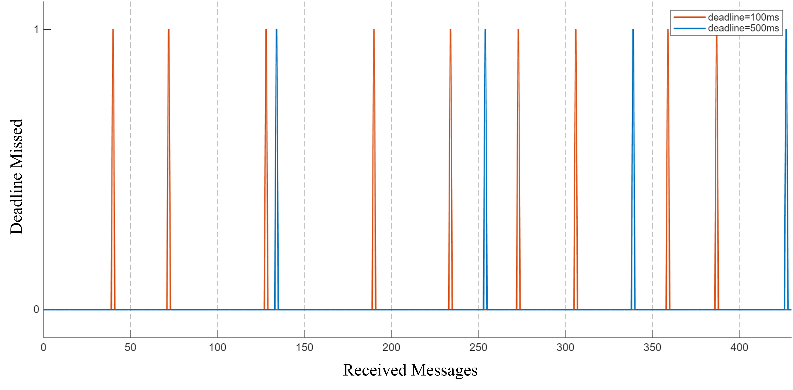

# EMP Rules

This page describes the QoS dependency rules derived from **Empirical analysis and experimental results**. These rules focus on runtime performance, network conditions (e.g., RTT), and timing-critical dependencies that were validated through systematic testing.

---

## Stage 1
*Intra-entity Dependency Validation*

| No. | Identifier | QoS Conflict Condition (Violation) | Dependency | Entity | Basis |
|:---:|:---|:---|:---:|:---:|:---:|
| [6](#rule-6) | LFSPAN → DURABL | $[DURABL \ge TRAN\_LOCAL] \wedge [LFSPAN.duration > 0]$ | Functional | Pub | EMP |

---

## Stage 3
*Timing-based Dependency Validation*

| No. | Identifier | QoS Conflict Condition (Violation) | Dependency | Entity | Basis |
|:---:|:---|:---|:---:|:---:|:---:|
| [31](#rule-31) | HIST → RELIAB | $[RELIABLE] \wedge [KEEP\_LAST] \wedge [depth < \lceil RTT/PP \rceil + 2]$ | Functional | Pub | EMP |
| [32](#rule-32) | RESLIM → RELIAB | $[RELIABLE] \wedge [KEEP\_ALL] \wedge [mpi < \lceil RTT/PP \rceil + 1]$ | Functional | Pub | EMP |
| [33](#rule-33) | LFSPAN → RELIAB | $[RELIABLE] \wedge [LFSPAN.duration < RTT \times 2]$ | Functional | Pub | EMP |
| [35](#rule-35) | RELIAB → DEADLN | $[DEADLN.period > 0] \wedge [RELIAB = BEST\_EFFORT]$ | Functional | Sub | EMP |
| [36](#rule-36) | LIVENS → DEADLN | $[DEADLN.period > 0] \wedge [LIVENS.lease < DEADLN.period]$ | Functional | Sub | EMP |
| [37](#rule-37) | HIST → DURABL | $[DURABL \ge TRAN\_LOCAL] \wedge [KEEP\_ALL] \wedge [mpi \ge default]$ | Operational | Pub | EMP |
| [38](#rule-38) | DEADLN → OWNST | $[OWNST = EXCLUSIVE] \wedge [DEADLN.period < 2 \times PP]$ | Operational | Sub | EMP |
| [39](#rule-39) | LIVENS → OWNST | $[OWNST = EXCLUSIVE] \wedge [lease < 2 \times PP]$ | Operational | Sub | EMP |

---

*(Note: mpi = max_samples_per_instance, PP = Publish Period, RTT = Round Trip Time)*

##  Experimental Evidence Details

### Rule 6
*Validates why Durability (Transient Local) requires a non-zero Lifespan to provide late-joining data.*

**1. Experimental Setup**

* **Publisher:** Durability = `TRANSIENT_LOCAL`, Lifespan = `50ms`
* **Subscriber 1 (Existing):** Launched before Publisher.
* **Subscriber 2 (Late-joiner):** Launched after Publisher finishes sending 1,000 samples.
* **Total Samples Sent:** 1,000

**2. Test Scenario (Step-by-Step)**

1.  Launch **Subscriber 1** to monitor live data.
2.  Launch **Publisher** and transmit 1,000 samples (Total time taken > 50ms).
3.  Confirm **Subscriber 1** received all 1,000 samples.
4.  Launch **Subscriber 2** (Late-joiner) to retrieve historical data from the Publisher's buffer.

**3. Experimental Observation**

| Entity | Expected Received | Actual Received | Status |
| :--- | :---: | :---: | :---: |
| Subscriber 1 (Live) | 1,000 | 1,000 | ✅ Success |
| Subscriber 2 (Late) | 1,000 | **0** | ❌ Data Expired |

**4. Empirical Conclusion**

Even though `TRANSIENT_LOCAL` is set to store data for late-joiners, the **Lifespan (50ms)** caused all buffered samples to be purged from the Publisher's queue before Subscriber 2 could connect.

---

### Rule 31 
*Justifies the minimum History Depth required to prevent data loss in Reliable communication under network delay and loss.*

**1. Experimental Setup**

* **QoS Profile:** Reliability = `RELIABLE`, History Kind = `KEEP_LAST`
* **Network Condition (Loss):** 5% Packet Loss (Simulated via `tc`)
* **Network Condition (Delay):** 100ms to 500ms RTT (Round Trip Time)
* **Publication Period (PP):** 100ms (10Hz)
* **Variable:** History Depth ($1 \sim N$)

**2. Test Scenario (Step-by-Step)**

1.  Set the network packet loss to 5% and RTT to a range of 100ms to 500ms.
2.  Transmit 1,000 samples from Publisher to Subscriber.
3.  Decrease the History Depth incrementally for each test run.

**3. Experimental Observation**

  

  

**4. Empirical Conclusion**

In a lossy network (5% loss), a Reliable connection requires retransmission of lost packets. If the **History Depth** is smaller than the number of samples sent during one **RTT**, the buffer is overwritten before a retransmission can be requested. 

---
### Rule 32
*Justifies the minimum Resource Limits (max_samples_per_instance) required to sustain reliable transmission under network delay.*

**1. Experimental Setup**

* **QoS Profile:** Reliability = `RELIABLE`, History Kind = `KEEP_ALL`
* **Resource Limits:** `max_samples_per_instance` (Variable: $1 \sim N$)
* **Network Condition:** packet loss 5%
* **Network Latency (RTT):** 100ms, 200ms, 300ms, 400ms (Simulated via `tc`)
* **Publication Period (PP):** 100ms (10Hz)

**2. Test Scenario (Step-by-Step)**

1.  Connect two notebooks and verify the baseline RTT.
2.  Set the Publisher's History to `KEEP_ALL` to ensure all samples are subject to Resource Limits.
3.  Vary the RTT from 100ms to 400ms using network emulation tools.
4.  Decrease `max_samples_per_instance` until sample rejected or lost events occur.
5.  Record the minimum `mpi` value that ensures 100% successful delivery.

**3. Experimental Observation**

**4. Empirical Conclusion**

When using `KEEP_ALL`, the `max_samples_per_instance` (mpi) acts as the effective buffer size for the reliability protocol. If mpi is insufficient to hold all samples sent during one **RTT** (plus the time for ACK/NACK processing), the Publisher will either block or drop samples.

---
### Rule 33
*Justifies the minimum Lifespan duration required to ensure sample reception before expiration in reliable communication.*

**1. Experimental Setup**

* **QoS Profile:** Reliability = `RELIABLE`, Lifespan = `Variable`
* **Publication Period (PP):** 10ms to 100ms
* **Lifespan Duration:** 100ms to 1000ms
* **Total Samples:** 10,000

**2. Test Scenario (Step-by-Step)**

1.  Fix the total number of samples to be sent at 10,000.
2.  Perform a grid search by varying the **Publish Period (PP)** from 10ms to 100ms and **Lifespan duration** from 100ms to 1000ms.
3.  Measure the total number of samples successfully received at the Subscriber.
4.  Identify the threshold where sample reception starts to drop despite using `RELIABLE` QoS.

**3. Experimental Observation**

* **High Reception Zone (Blue):** When Lifespan is sufficiently longer than RTT and PP, nearly all 10,000 samples are received.
* **Low Reception Zone (White/Gray):** When Lifespan duration is close to or shorter than the round-trip retransmission time, samples expire before they can be successfully delivered or processed.

**4. Empirical Conclusion**

Even with `RELIABLE` settings, data loss occurs if the **Lifespan duration** is shorter than the time required for successful transmission and acknowledgement. 

---
### Rule 35
*Justifies how Reliability settings impact Deadline compliance under packet loss conditions.*

**1. Experimental Setup**

* **QoS Profile:** Deadline Period = `150ms`, Reliability = `RELIABLE` vs `BEST_EFFORT`
* **Network Condition (Loss):** 5% Packet Loss (Simulated via `tc`)
* **Publication Period (PP):** 100ms
* **Total Samples:** 1,000

**2. Test Scenario (Step-by-Step)**

1.  Set the Publisher and Subscriber with a Deadline period of 150ms.
2.  Introduce 5% packet loss to the network interface.
3.  Case A: Configure both entities with `RELIABLE` Reliability.
4.  Case B: Configure both entities with `BEST_EFFORT` Reliability.
5.  Publish 1,000 samples and monitor the `on_requested_deadline_missed` callback at the Subscriber.

**3. Experimental Observation**

| Reliability | Total Samples | Received Samples | Deadline Missed Count | Cause of Violation |
| :--- | :---: | :---: | :---: | :--- |
| **RELIABLE** | 1,000 | 1,000 | 25 | Delay caused by Retransmission |
| **BEST_EFFORT** | 1,000 | ~950 | 48 | Gap caused by Packet Loss |

**4. Empirical Conclusion**

The experimental results highlight two different causes of Deadline violations:
1. In **RELIABLE** mode, all 1,000 samples were received, but 25 samples violated the Deadline because the time taken for NACK-based retransmission exceeded the 150ms window.
2. In **BEST_EFFORT** mode, violations nearly doubled (48 times) because lost packets created permanent gaps in the data stream, directly triggering the Deadline timer.

---
### Rule 36
*Justifies the consistency requirement between Liveliness Lease Duration and Deadline Period to avoid redundant or conflicting fault detections.*

**1. Experimental Setup**

* **Publication Period (PP):** 100ms
* **Deadline Period:** 200ms
* **Total Samples:** 600 (Total duration: 60s)
* **Liveliness Lease Duration**: Variable

**2. Test Scenario (Step-by-Step)**

The network condition is controlled over 60 seconds using the `tc` command:
1.  **0s ~ 20s (Loss 0%):** Normal communication.
2.  **20s ~ 40s (Loss 10%):** Induce occasional **Deadline Missed** due to retransmission delays.
3.  **40s ~ 45s (Loss 100%):** Induce **Liveliness Lost** by blocking all packets.
4.  **45s ~ 60s (Loss 0%):** Restore communication and observe recovery.

**3. Experimental Observation & Empirical Conclusion [ISSUE]**

**[ISSUE]** Liveliness Lost is triggered prematurely (approx. 60~80ms). Even though the Publisher is already marked as 'Offline', **Deadline Missed alarms continue to trigger late at the 200ms mark.**

**[Conclusion]**
The experiment demonstrates that when `Lease Duration < Deadline`, the system falls into a contradictory state: it continues to fire "Data Missing" alarms (Deadline Missed) for a Publisher that it has already declared "Dead" (Liveliness Lost). 

To prevent this **state inconsistency** and ensure a logical fault-detection sequence (where the data stream is monitored within the lifespan of the entity), the Liveliness Lease Duration must always be longer than the Deadline Period:
$$LIVENS.lease \ge DEADLN.period$$

---
### Rule 37
*Justifies the impact of Resource Limits on the recovery latency for late-joining subscribers in durable communication.*

**1. Experimental Setup**

* **QoS Profile:** Durability = `TRANSIENT_LOCAL`, History = `KEEP_ALL`
* **Variable:** `max_samples_per_instance` (mpi) ranging from 1,000 to 5,000
* **Data Volume:** Sample count up to 1,600
* **Metric:** Latency (ms) required for the system to reach steady-state convergence

**2. Test Scenario (Step-by-Step)**

1.  Initialize a Publisher that sends samples continuously with `TRANSIENT_LOCAL` durability.
2.  After a specific number of samples are published, introduce a Late-Joining Subscriber.
3.  Vary the **max_samples_per_instance** setting on the Subscriber side.
4.  Measure the latency between the sample generation time and the time it is actually processed by the late-joiner.
5.  Observe how long the "catch-up" phase lasts before latency returns to normal levels.

**3. Experimental Observation**

* **Low mpi Zone:** Recovery is relatively fast
* **High mpi Zone:** As `max_samples_per_instance` increases towards 5,000, the recovery latency increases exponentially (reaching up to 50,000ms). The system takes significantly longer to converge to a steady state.

**4. Empirical Conclusion**

The experiment proves that setting an excessively high `max_samples_per_instance` for the sake of data completeness leads to a **"Recovery Latency Storm."** For a late-joining node, processing thousands of buffered historical samples simultaneously saturates the available bandwidth and CPU, causing current data to be delayed by tens of seconds.

To balance data durability with system responsiveness, the resource limits must be tuned based on the expected maximum network downtime and the acceptable recovery window:
$$[DURABL \ge TRAN\_LOCAL] \wedge [KEEP\_ALL] \implies mpi \ge default$$
*(Note: $default$ should be calculated based on the maximum tolerable recovery time.)*

---
### Rule 38
*Justifies the minimum Deadline period required to maintain stable Ownership in exclusive communication under network instability.*

**1. Experimental Setup**

* **QoS Profile:** Ownership = `EXCLUSIVE`, Reliability = `RELIABLE`
* **Variable:** Deadline Period (`100ms` vs `500ms`)
* **Network Condition:** 5% Packet Loss (Simulated via `tc`)
* **Publication Period (PP):** 100ms
* **Total Samples:** 400

**2. Test Scenario (Step-by-Step)**

1.  Configure two Publishers with different strengths for `EXCLUSIVE` ownership.
2.  Set both Publishers and the Subscriber to `RELIABLE` reliability to ensure eventual delivery.
3.  Introduce a constant 5% packet loss using the `tc` command.
4.  **Case A:** Set the Deadline period to `100ms` (equal to the PP).
5.  **Case B:** Set the Deadline period to `500ms` ($5 \times PP$).
6.  Monitor the `on_requested_deadline_missed` callback and track how often the active owner is switched due to deadline timeouts.

**3. Experimental Observation**

* **Case A (Deadline = 100ms - Orange):** Numerous spikes are observed throughout the experiment. Any minor retransmission delay caused by the 5% loss immediately triggers a deadline miss, leading to unstable ownership.
* **Case B (Deadline = 500ms - Blue):** Significantly fewer and more sparse spikes appear. The larger window provides sufficient time for the `RELIABLE` protocol to recover lost packets through NACK/retransmission before the 500ms timer expires, maintaining a more consistent owner state.

**4. Empirical Conclusion**

The experiment clearly demonstrates that **Ownership Stability** is highly dependent on the **Deadline** period in lossy networks. A tight deadline (Case A) causes "Ownership Churning," where control is frequently and unnecessarily handed over due to transient network jitters. 

By extending the Deadline (Case B), the system becomes more resilient to packet loss, ensuring that the primary owner remains active as long as retransmissions are successful within the extended margin. To ensure stable control in exclusive ownership, the Deadline should be at least twice the Publication Period:
$$[OWNST = EXCLUSIVE] \implies DEADLN.period \ge 2 \times PP$$

---
### Rule 39
*Justifies the impact of Liveliness Lease Duration on Ownership stability by preventing premature entity failure detection.*

**1. Experimental Setup**

* **QoS Profile:** Ownership = `EXCLUSIVE`, Liveliness = `AUTOMATIC`
* **Variable (Lease Duration):** 50ms, 100ms, 300ms, 500ms, 800ms
* **Network Condition:** 80% Packet Loss (Simulated via `tc`)
* **Publication Period (PP):** 100ms
* **Metric:** Total count of Liveliness Lost events

**2. Test Scenario (Step-by-Step)**

1.  Initialize two Publishers with different strengths for `EXCLUSIVE` ownership.
2.  Apply a harsh network environment with **80% packet loss** using the `tc` command.
3.  Publish a total of **10,000 samples** to observe long-term stability.
4.  Vary the **Liveliness Lease Duration** from 50ms to 800ms.
5.  Record the frequency of ownership handovers triggered by `on_liveliness_changed` at the Subscriber side.

**3. Experimental Observation**

* **Short Lease Duration (50ms - 100ms):** A high frequency of Liveliness Lost events is observed (up to 26 times). Since the lease duration is shorter than or equal to the Publication Period (100ms), even a single delayed heartbeat triggers a failure detection.
* **Long Lease Duration (300ms - 800ms):** The event count drops significantly as the lease duration increases. At 800ms, only 10 events occur, indicating that the system can tolerate multiple lost or delayed heartbeats without dropping the ownership.

**4. Empirical Conclusion**

The experiment highlights the risk of **"False Positive Failures."** When the Liveliness Lease Duration is too aggressive (close to the $PP$), transient network issues cause the Subscriber to frequently revoke ownership from the primary Publisher. This leads to unstable system control and unnecessary handovers.

To maintain a stable Ownership state, the Liveliness Lease Duration must be set with enough margin to accommodate at least two consecutive heartbeat losses or retransmission delays:
$$[OWNST = EXCLUSIVE] \implies lease\_duration \ge 2 \times PP$$

---

## Notation Summary
* **mpi**: `max_samples_per_instance`
* **PP**: `Publish Period` 
* **RTT**: `Round Trip Time` 
